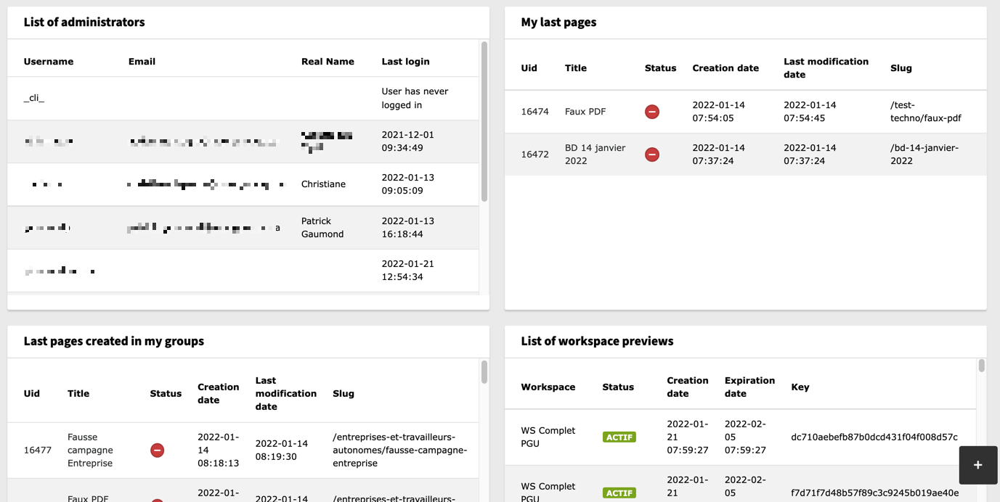

Qc Widgets
==============================================================
*La [version française](#documentation-qc-widgets) de la documentation suit le texte anglais*

## About
This extension provides a set of widgets for the TYPO3 Dashboard Backend module. Most widgets display lists of records related to the current logged in user.
The amount of records to display (default 25) can be changed in User or Group TSconfig. The list of widgets is:

- List of *my* group members
- Last created Pages in *my* groups
- Pages without modification
- My last modified pages
- My last modified content elements
- List of my Workspace preview links
- Number of records by table

Screenshot of 4 of the widgets



All the pages widget share the same information: uid, Title, Status, Creation date, Last modification date and Slug. A click on the UID or Title of the page will redirect to the Page Module, on the clicked page.

As usual, you can select which widgets are available to editors by managing the BE group rights for each widget.

## Details about the provided widgets :

### List of my groups members 
This widget display details (username, email, real name and last login) of users who belong to the same groups as the logged in user. 
If the current user is a TYPO3 administrator, the widget will display the list of administrators.

### Last created Pages in my groups
This widget displays the list of the recent pages created by members who belong to the same groups as the user. 

###  Pages without modification
This widget shows pages that haven't been touched for X months. Default is 3 months. Gives an overview of "neglected" pages. 

### My last modified pages
This widget allows to display the list of the pages last modified by the current user. 

### My last modified pages
Related to the logged in user. His recent work on pages.

### My last modified content elements
Related to the logged in user. His recent work on tt_content.

### List of my Workspace preview links
This widget displays a list (default 25) of Workspace preview links created by members who belong to the same groups as the current user. The columns are Workspace title, status (expired or active), creation date, expiration date and key (the key in links like `?ADMCMD_prev=8a636e5d5545c1bb1dec5a5f77a96ca4`.

### Number of records by table
This widget shows for each table set in the tsconfig, the number of records added since X days (365 days by default), the number of records added in the last 24 hours and the total number of records.

## User and Group TSconfig

```php
mod{
    qcWidgets{
        //All limits have a default set to 25 if not set.
        lastCreatedPages{
            limit = 0
        }
        lastModifiedPages{
            limit = 0
        }
        workspaceProviderLinks{
            limit = 0
        }
        pagesWithoutModification{
            limit = 0
            numberOfMonths = 3
        }
        recentlyModifiedContent{
            limit = 0
        }
        listOfmembers{
        // When value is 0 (zero), the Widget will dig into sub-groups
            dontLookintoSubgroups = 1
        }
        numberOfRecordsByType{
            fromTable =  pages, tt_content, be_sessions, sys_redirect, be_users
            // All the options accept only 0 or 1, except the totalRecordsByNumberOfDays option
            columns {
                totalRecords = 1
                totalRecordsForTheLast24h = 1
                totalRecordsByNumberOfDays = 365
            }
            // This filters will be applied on all tables selected in the 'fromTable' option
            filter {
                excludeDisabledItems = 1
                excludeHiddenItems = 1
            }
        }
    }
}
```

-----------
[Version française]
# Documentation «Widgets Qc»

## À propos
Cette extension fournit un ensemble de «widgets» pour le module "Dashboard" de TYPO3. La plupart des «widgets» affichent des listes d'enregistrements liés à l’utilisateur connecté.
La quantité d'enregistrements affichés par défaut est de 25 et peut être modifiée par TSconfig de Groupe ou d'Utilisateur. 

Les «widgets» offerts sont:

- Liste  des utilisateurs de mon groupe
- Dernières pages créées par mes groupes
- Pages sans modification (depuis x mois)
- Mes dernières pages modifiées 
- Mes derniers contenus édités
- Liste des liens de prévisiualisation d'espaces de travail (Workspace)
- Nombre d'enregistrements par table


Tous les «widgets» de pages affichent les mêmes informations: uid, titre, état, date de création, date de modification and segment d'URL (slug). Un clic sur le uid ou le titre ouvre le module Page sur l'enregistrement sélectionné.

Comme d'habitude, on peut sélectionner quels «widgets» sont disponibles dans les droits d'utilisateur ou de groupe.

## Détails sur les widgets de l'extension

### Liste des utilisateurs de mon groupe
Ce «widget» permet d'afficher les détails (utilisateur, courriel, nom réel, dernière connexion) des utilisateurs associés aux mêmes groupes que l’utilisateur connecté. Si cet utilisateur est un administrateur TYPO3, le widget va afficher la liste des administrateurs. 

### Dernières pages créées dans mes groupes
Ce «widgets» permet d’afficher la liste des dernières pages créées par les utilisateurs associés à vos groupes.

###  Pages sans modification (depuis x mois)
Ce «widget» permet de lister les pages sans modification depuis "x" mois. Le nombre de mois par défaut est de 3. Il permet notamment de repérer les pages orphelines ou en déficit d'entretien qui peuvent contenir des informations erronées ou dépassées.

### Mes dernières pages modifiées
Ce «widget» permet d’afficher la liste des dernières pages modifiées par l’utilisateur connecté.

###  Mes derniers contenus édités
Ce «widget» permet d’afficher la liste des derniers contenus (tt_content) édités par l’utilisateur connecté.

### Liste des liens de prévisiualisation d'espaces de travail (Workspace)
Ce «widget» permet d'afficher la liste des 25 derniers liens d’aperçu générés par les utilisateurs d'un ou plusieurs groupes. L'utilisateur connecté verra ses liens et ceux de ses collaborateurs appartenant à l'un ou l'autre des groupes auxquels il est associé. Les colonnes sont : Titre de l'Espace de travail, état (expiré ou actif), date de création, date d'expiration et la clé qu'on retrouve dans l'URL (ex:  `?ADMCMD_prev=8a636e5d5545c1bb1dec5a5f77a96ca4`).

### Nombre d'enregistrements par table
Ce «widget» permet d’afficher pour chaque table configurée dans le TSconfig, le nombre d'enregistrements ajoutés par X jours (par défaut 365 jours), le nombre d'enregistrements ajoutés dans les dernières 24 heures et le nombre total d'enregistrements.


## TSconfig utilisateur ou groupe

```php
mod{
    qcWidgets{
        //Toutes les limites sont à 25 par défaut.
        lastCreatedPages{
            limit = 0
        }
        lastModifiedPages{
            limit = 0
        }
        workspaceProviderLinks{
            limit = 0
        }
        pagesWithoutModification{
            limit = 0
            numberOfMonths = 3
        }
        recentlyModifiedContent{
            limit = 0
        }
        listOfmembers{
        // Si cette valeur est à 0 (zéro), le widget va rechercher les sous-groupes
            dontLookintoSubgroups = 1
        }
        numberOfRecordsByType{
            fromTable =  pages, tt_content
            // Toutes les options n'acceptent que 0 ou 1, sauf l'option totalRecordsByNumberOfDays
            columns {
                totalRecords = 1
                totalRecordsForTheLast24h = 1
                totalRecordsByNumberOfDays = 365
            }
            // Ces filtres seront appliqués sur toutes les tables sélectionnés dans l'option 'fromTable'
            filter {
                excludeDisabledItems = 1
                excludeHiddenItems = 1
            }
        }
    }
}
```
